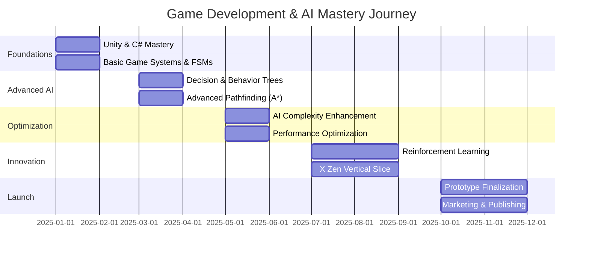

<div align="center">


# ⚡ Youssef Salama

**Game Developer • AI Architect • Interactive Systems Engineer**

<br/>

> *Crafting immersive gaming experiences through intelligent systems and cutting-edge technology*

<br/>

[](https://truthless-creative-hub.lovable.app/)
[](https://www.youtube.com/@TruthlessTavern)
[](https://www.linkedin.com/in/youssef-salama-876959392)
[](https://www.behance.net/youssefsalama14)

---

## 🎯 About Me

I specialize in building next-generation gaming experiences where **artificial intelligence meets interactive storytelling**. My focus lies in creating intelligent game systems that breathe life into virtual worlds.

**Core Competencies:**

- 🎮 **Game Development** — PC & Console platforms with performance-first approach
- 🤖 **Gameplay AI** — Intelligent NPCs, decision systems, and adaptive behaviors
- 🌍 **World Building** — Immersive environments and dynamic storytelling systems
- ⚙️ **Systems Design** — Scalable game mechanics and architectural patterns
- 🔧 **Technical Optimization** — Performance-critical code and efficient algorithms

---

## 🛠️ Technology Arsenal

### Game Engines & Languages
<div>


</div>

### Specialized Systems
<div>


</div>

### Additional Tools
<p>
<code></code>
<code></code>
<code></code>
<code></code>
<code></code>
</p>

---

## 🚀 Featured Projects

### 🎮 X Zen — Narrative-Driven Action Experience
**🏆 Flagship Project | In Active Development**

An ambitious story-driven action game exploring themes of artificial intelligence, warfare, and humanity's future.

**Technical Highlights:**
- Multi-dimensional world system with seamless transitions
- Advanced enemy AI with adaptive combat behaviors
- Lore-integrated progression mechanics
- Dynamic narrator system responding to player choices

📌 *Status: Private Development*

---

### 🧠 Neural NPC Framework
**AI Architecture System**

A sophisticated behavior system designed for creating believable, reactive NPCs in modern game environments.

**Key Features:**
- Hierarchical decision trees and finite state machines
- Context-aware responses to player actions
- Modular and reusable AI components
- Performance-optimized for large-scale simulations

📌 *Status: Documentation Phase*

---

### 🗺️ Infinite World Engine
**Procedural Generation System**

An algorithmic level generation framework focused on creating endless replayability while maintaining design quality.

**Capabilities:**
- Real-time map generation with customizable parameters
- AI-powered difficulty adjustment
- Memory-efficient chunk-based world streaming
- Seed-based reproducibility for testing

📌 *Status: Prototype Testing*

---

### 🌐 Truthless Creative Hub
**Digital Portfolio & Showcase**

A centralized platform showcasing my game development journey, experiments, and creative projects.

🔗 **[Visit Hub](https://truthless-creative-hub.lovable.app/)**

---

### 🔬 AI Tactics Laboratory
**Research & Development Sandbox**

Experimental playground for prototyping and testing advanced AI concepts in interactive environments.

**Research Areas:**
- Advanced pathfinding algorithms (A*, NavMesh optimization)
- Squad-based tactical AI
- Emergent behavior simulation
- Machine learning integration experiments

📌 *Status: Concept & Planning*

---

## 📌 Pinned Repositories

<table>
<tr>
<td width="50%">

### 🤖 [AI NPC System](https://github.com/svicko71/ai-npc-system)
Advanced AI NPC behavior with decision trees and modular components.

**Tech:** Unity • C# • FSM • Behavior Trees

</td>
<td width="50%">

### 🎯 [X Zen Game](https://github.com/svicko71/x-zen-game)
Story-driven action game featuring AI-enhanced gameplay and multi-world systems.

**Tech:** Unity • C# • AI Systems

</td>
</tr>
<tr>
<td width="50%">

### 🗺️ [Procedural Level Generator](https://github.com/svicko71/procedural-level-generator)
Procedural map and level generation engine with AI difficulty scaling.

**Tech:** Unity • C# • Algorithms

</td>
<td width="50%">

### 🧪 [Game AI Playground](https://github.com/svicko71/game-ai-playground)
Experimental AI concepts and pathfinding simulations for game environments.

**Tech:** Unity • C# • A* • NavMesh

</td>
</tr>
</table>

---

## 🗓️ Development Roadmap (2025)



### 📋 Detailed Timeline

**Phase 1: Foundations (Months 1-2)**
- Master Unity & C# fundamentals
- Build basic game systems and AI with FSMs
- Complete mini-projects for practice

**Phase 2: Advanced AI (Months 3-4)**
- Develop advanced AI (Decision Trees, Behavior Trees)
- Implement pathfinding algorithms (A*, Dijkstra)
- Create reusable AI framework

**Phase 3: Optimization (Months 5-6)**
- Enhance AI complexity and intelligence
- Optimize performance for large-scale systems
- Build enemy combat AI with adaptive behaviors

**Phase 4: Innovation (Months 7-9)**
- Explore Reinforcement Learning concepts
- Develop X Zen vertical slice
- Implement dynamic narrative system

**Phase 5: Launch (Months 10-12)**
- Finalize prototype with polish
- Create marketing materials and trailers
- Launch on Steam/itch.io
- Update portfolio and social media

---

## 📊 GitHub Stats

<div align="center">


</div>

---

## 🎓 Project Template

Use this template structure for your game development projects:

```markdown
# 🎮 Project Name

## 📖 Overview
Brief description of the game or system. What makes it unique?

## ✨ Features
- 🎯 Feature 1: Description
- 🤖 Feature 2: Description
- 🌍 Feature 3: Description

## 🛠️ Tech Stack
- **Engine:** Unity / Unreal Engine
- **Language:** C# / C++
- **Tools:** Git, Visual Studio, etc.

## 📸 Screenshots / Demo


## 🚀 Getting Started
1. Clone the repository
2. Open in [Engine Name]
3. Run the project

## 📊 Status
🚧 In Development / ✅ Completed / 🔄 Maintenance

## 👤 Author
**Youssef Salama**
- 🌍 [Portfolio](https://truthless-creative-hub.lovable.app/)
- 💼 [LinkedIn](https://www.linkedin.com/in/youssef-salama-876959392)

## 📄 License
MIT License (or your preferred license)
```

---

## 💡 Skills & Expertise

<div align="center">

| Category | Skills |
|----------|--------|
| **Game Engines** | Unity (Advanced) • Unreal Engine (Intermediate) |
| **Programming** | C# (Expert) • C++ (Advanced) • Python (Intermediate) |
| **AI Systems** | FSM • Behavior Trees • Decision Trees • Pathfinding |
| **Game Design** | Level Design • Game Mechanics • Balancing |
| **Tools** | Git • Visual Studio • Blender • Photoshop |

</div>

---

## 🏆 Achievements & Badges

<div align="center">


</div>

---

## 💭 Philosophy

```text
"Games are not just entertainment — they're interactive experiences 
that challenge, inspire, and connect us. I don't just build games; 
I architect worlds where technology and creativity converge to create 
unforgettable moments."
```

---

## 📬 Get In Touch

I'm always interested in collaborating on innovative gaming projects, discussing AI in games, or sharing knowledge with fellow developers.

**Let's Connect:**

- 💼 **Professional Inquiries:** [LinkedIn](https://www.linkedin.com/in/youssef-salama-876959392)
- 🎨 **Creative Work:** [Behance](https://www.behance.net/youssefsalama14)
- 🎬 **Video Content:** [YouTube](https://www.youtube.com/@TruthlessTavern)
- 🎵 **Short Content:** [TikTok](https://www.tiktok.com/@truthlesstavern1)
- 🌍 **Portfolio:** [Creative Hub](https://truthless-creative-hub.lovable.app/)

---

<div align="center">

### *"Engineering tomorrow's gaming experiences, today."*

<sub>⚡ Powered by passion, precision, and endless curiosity</sub>

<br/>


[](https://github.com/svicko71)

<br/>

**© 2025 Youssef Salama • Game Developer & AI Architect**

</div>

</div>
